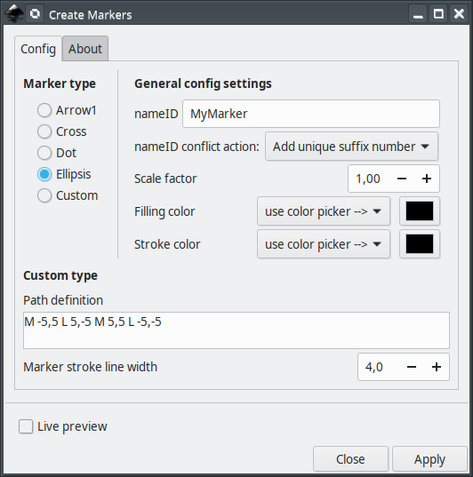

# createMarkers
This extensil will assist you creating new markers with custom shapes and colors for [Inkscape](https://inkscape.org/).


# Main features

The main features/advantages are

1. It is a convenient way to produce predefined markers you use very often. Right now, there are 4 predefined types (dot, arrow1, ellipsis, cross), but this number can grow fast if people ask or expand this extension. If you have some basic skills on python scripting, you can easily add your own predefined markers.

2. It is possible to quickly control maker colors (both filling and stroke).

3. Easy control over its scale with respect to the line width. By using the standard `standard Object->Object to Marker` present in Inkscape, You would need to make several copies of your custom marker, with different scales and proceed in a try-and-error approach to find the desired result.

4. It is a convenient way to modify/redefine a marker in your document. You just need to set the same nameID and  choose to overwrite the old marker definition.

# Current and older versions

Compatibility table

  Inkscape        |  createMarkers  | inkscapeMadeEasy | Receive updates?
------------------|-----------------|------------------|-----------------
       1.0        | 1.0 (latest)    |    1.0 (latest)  | YES
 0.48, 0.91, 0.92 | 0.9x (obsolete) |  0.9x (obsolete) | NO


**Latest version:** The latest version of **createMarkers** is **1.0**. This version is compatible with Inkscape 1.0 and up only. It is **incompatible** with older Inkscape versions!

**Older versions:** If you have an older version of Inkscape, please use the files under the folder **0.9x** on Github.

**Important: Only the latest version will receive updates, new features, and bug fixes! The usage section in this documentation describes the latest version. In older versions, the disposition of the elements in the plugin's screen might be different. Some features might not be present or have different behavior.**

# Installation and requirements

Installation procedures for latest and older versions are described below.

## Requirements (all versions)

- You will need [inkscapeMadeEasy](https://github.com/fsmMLK/inkscapeMadeEasy) plugin installed. Check the compatibility table above to know the correct version you need.

## Installation procedure (v1.0 only)

**createMarkers** was developed using Inkscape 1.0 in Linux (Kubuntu 18.04). It should work in different OSs too as long as all requirements are met.

1. Install [inkscapeMadeEasy](https://github.com/fsmMLK/inkscapeMadeEasy), **version 1.0** (latest). Follow the instructions in the manual page. **Note:** No LaTeX text is used in **createMarkers**, so there is no reason to install LaTeX support if you don't have any other extensions that employ inkscapeMadeEasy. However, you must follow the instructions and disable LaTeX support since it is enabled by default. See inkscapeMadeEasy's documetation pages.

2. **createMarkers** installation

    1. Go to Inkscape's extension directory with a file browser. Your inkscape extension directory can be accessed by opening Inkscape and selecting ``Edit > Preferences > System``. Look for the item **User Extensions**  field. There is a button on the right of the field  that will open a file explorer window in that specific folder.

    2. Create a subfolder in the extension directory with the name ``createMarkers``. **Important:**  Be careful with upper and lower case letters. You must write as presented above.

    3. Download **createMarkers** files and place them inside the directory you just created.

       You don't have to copy all files from Github. The files you will need are `createMarkers.py` and `createMarkers.inx`. **You can find these files inside the ``latest`` folder**. In the end you must have the following files and directories in your Inkscape extension directory.

        ```
           inkscape
            ┣━━extensions
            ┋   ┣━━ inkscapeMadeEasy      <-- inkscapeMadeEasy folder
                ┃    ┣━━ inkscapeMadeEasy_Base.py
                ┃    ┣━━ inkscapeMadeEasy_Draw.py
                ┃    ┣━━ inkscapeMadeEasy_Plot.py
                ┃    ┗━━ basicLatexPackages.tex
                ┃
                ┣━━ textext               <-- texText folder (if you installed textText)
                ┃    ┋
                ┃
                ┣━━ createMarkers         <-- createMarkers folder
                ┋    ┣━━ createMarkers.py
                     ┗━━ createMarkers.inx
        
        NOTE: You might have other sub folders inside the extensions directory. They don't interfere with the plugin.
        ```

## Installation procedure (v0.9x only)

**createMarkers** was developed using Inkscape 0.48 and 0.91 in Linux (Kubuntu 18.04). It should work in different OSs too as long as all requirements are met.

1. Install [inkscapeMadeEasy](https://github.com/fsmMLK/inkscapeMadeEasy), **version 0.9x** (obsolete). Follow the instructions in the manual page. **Note:** No LaTeX text is used in **createMarkers**, so there is no reason to install LaTeX support if you don't have any other extensions that employ inkscapeMadeEasy. However, you must follow the instructions and disable LaTeX support since it is enabled by default. See inkscapeMadeEasy's documetation pages.

2. **createMarkers** installation

    1. Go to Inkscape's extension directory with a file browser.

    2. Download **createMarkers** files and place them inside the directory you just created.

       You don't have to copy all files from Github. The files you will need are `createMarkers.py` and `createMarkers.inx`. **You can find these files inside the ``0.9x`` folder**. In the end you must have the following files and directories in your Inkscape extension directory.

        ```
        inkscape
            ┣━━extensions
            ┋   ┣━━ inkscapeMadeEasy_Base.py
                ┣━━ inkscapeMadeEasy_Draw.py
                ┣━━ inkscapeMadeEasy_Plot.py
                ┣━━ textextLib
                ┃   ┣━━ __init__.py
                ┃   ┣━━ basicLatexPackages.tex
                ┃   ┣━━ textext.inx
                ┃   ┣━━ textext.py
                ┃
                ┣━━ createMarkers.py            <-- from repository folder 0.9x!
                ┣━━ createMarkers.inx           <-- from repository folder 0.9x!
                ┋
        ```

# Usage

The extension can be found under `extensions > fsmMLK` menu.

This extension is presented in two tabs. The **Config** tab allows you to set most of the options for your marker, while the **Colors** tab allows you to select both stroke and filling colors.


## The Config tab



This tab is divided in three sections. **Marker type**, **General config settings**, and **Custom type**

#### Marker type section

On the first section, you can choose between a few predefined marker types, described below or select `Custom` and define your own marker.

 - **Arrow1**: similar to Inkscape's standard Arrow1 marker, but here you can easily choose the filling and stroke colors independently

 - **Dot**: similar to some of the standard markers present in Inkscape. If you want to mimic inkscape's default dotS, dotM, and dotL markers, set the `Scale factor` to 0.2, 0.4 and 0.8 respectively.

 - **Ellipsis**: this marker differs from Inkscape's standard marker (InfiniteLine). Here the dots will follow the line width of your line (if `Scale factor` is set to 1.0)


#### General config settings section

On the second section you can adjust several aspects of the marker.

**nameID:** Here you can choose the name of the marker. Please see below how to configure its behavior when the extensions is faced with conflicting marker nameIDs.

**nameID conflict action:** Choose the action to take if the plugin faces conflict nameIDs, that is, if the name is already taken

   - **Do nothing and abort:**. If the nameID is already taken by another marker, the extension quits without modifying it.
   - **Overwrites definition:**. If the nameID is already taken by another marker, the extension overwrites the marker. **Attention:** This will modify all instances of that marker in your document!
  
     **Inkscape issue:** When a marker is created overwriting the definition, any marker with the same name might "disapear" from inkscape's canvas. This is just a display issue. Save the document and reload it, everything should load and show fine.
     
   - **Add unique suffix number:** If the nameID is already taken by another marker, the extension will add a suffix of the type `_nXXXXX`, where `XXXXX` is a number that guarantees that nameID+_nXXXXX is unique.

**Scale factor:** Adjusts the relative size between the element and the width of the line.


**Filling color and stroke color:** here you can choose the color of the filling and the color of the stroke present in the marker.

Note that the *stroke color* refers to the marker only, that is, the line itself can have a different color. See the examples below. 

In both cases, you have three options in the `Color` drop down menu:

  - You can select a few predefined colors. (See figure below)

  - You can select **none** to set no color (transparent)

  - You can select **use color picker** to choose the color from the color picker widget just to the right of the drop down menu. **Attention:** the color selected in the color picker widget will be considered **ONLY** if you select **use color picker** in the drop down menu. 


#### Custom type

On the third section you can define your own custom markers. The custom marker will be created **ONLY IF** you select *Custom* on the first section,  **Marker type**

**Path definition:** You must provide a valid SVG path's `d` attribute. Please check any SVG reference on syntax, e.g., [here](https://developer.mozilla.org/en-US/docs/Web/SVG/Tutorial/Paths). **Attention:** This extension **will not check the syntax of your definition**. Luckily, providing an invalid attribute does not cause serious crashes, therefore you can activate the 'Live preview' checkbox to help you while creating your marker.

**Marker stroke line width:** Adjust the line width of the path that form the marker. This has no relation with the line width of the path that will contain the marker.


### Observations

1. One small line segment with these markers at its ends is created in the center of your screen so that you can quickly visualize the marker. This is specially useful when you check the 'Live preview' box to adjust your marker.

1. The system of coordinates of the marker depends on the node under consideration (start, mid or end). The following figure presents the coordinate system of each case. **Remember that +y points down in Inkscape!**


# Examples


Blue cross: `M -3,3 L 3,-3 M 3,3 L -3,-3`

Smile boy: `M -5,0  a 5 5 0 1 1 10 0 a 5 5 0 1 1 -10 0 M -2,-3 v 2  M 2,-3 v 2  M -3,0  a 2 2 0 1 0 6 0 z`

Pac Boy: `M 4,3  a 5,5 0 0 1 -4 2 a 5,5 0 0 1 0,-10 a 5 ,5 0 0 1 4,2 L 0,0 z`

Ghosty (small): `M -5,0  a 5,5 0 0 1 10 0 l 0 6 l -2.5,-2.5 -2.5,2.5 -2.5,-2.5 -2.5,2.5 z M -2,1 l -0 -3 M 2,1 l -0 -3`

Ghosty (large): The same, but with different colors and scale factor


# To do

In the future this extension will also control transformations over the marker, e.g., rotation and translation. With these, you will be able to adjust its position and orientation with respect to the nodes. The `standard Object->Object to Marker` uses the center of the bounding box as the reference point and always assumes a horizontal path as reference orientation.
