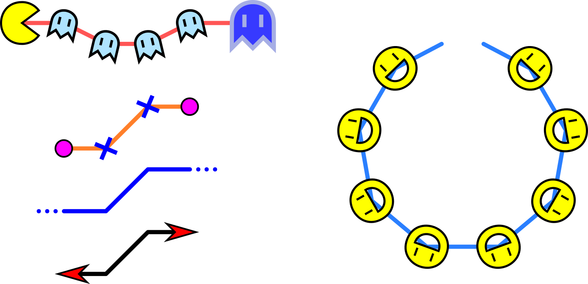
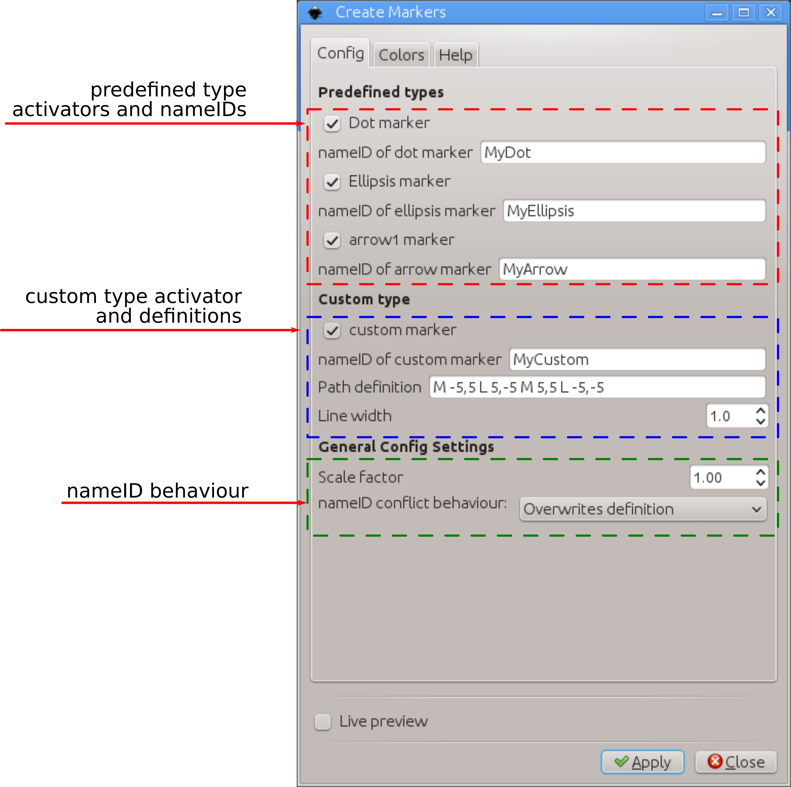
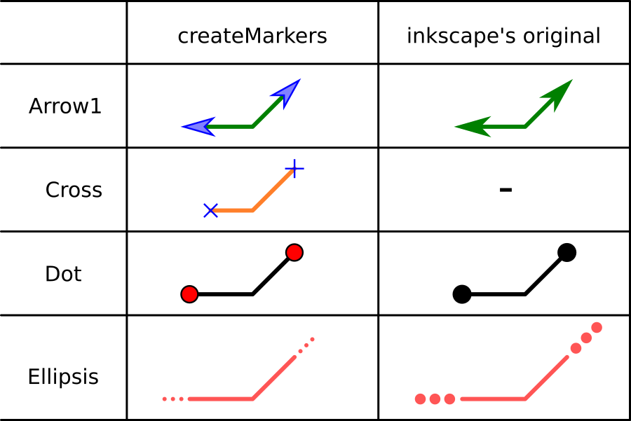

# createMarkers
Inkscape extension to assist creating new markers with custom shapes and colors.



### main features

The main features/advantages are

1-) It is a convenient way to produce predefined markers you use very often. Right now, there are just 3 predefined types (dot, arrow1, ellipsis), but this number can grow fast if people ask or expand this extension. If you have some basic skills on python scripting, you can easily add your own predefined markers.

2-) It is possible to quickly control maker colors (both filling and stroke). It is a nice way to control marker colors, specially in 0.91 since Inkscape forces the marker color to match the line color. I have no idea why they decided to do that.

3-) Easy control over its scale with respect to the line width. By using the standard `standard Object->Object to Marker` present in Inkscape, You would need to make several copies of your custom marker, with different scales and proceed with a try-and-error approach every time.

4-) It is a convenient way to modify/redefine a marker in your document. You just have to set the same nameID and set its configuration to overwrite the old definition.

# Installation and requirements

This extension was partially developed in Inkscape 0.48 and partially in 0.91 in Linux (Kubuntu 12.04 and 14.04). It should work on both versions of Inkscape. Also, they should work in different OSs too as long as all requirements are installed.

This extension requires another extension to run, inkscapeMadeEasy <https://github.com/fsmMLK/inkscapeMadeEasy>, which contains several backstage methods and classes.

In order to use createMarkers extension, you must also download inkscapeMadeEasy files and put them inside Inkscape's extension directory. Please refer to inkscapeMadeEasy installation instructions. In the end you must have the following files and directories in your Inkscape extension directory.

```
inkscape/extensions/
            |-- inkscapeMadeEasy_Base.py
            |-- inkscapeMadeEasy_Draw.py
            |-- inkscapeMadeEasy_Plot.py
            |-- textextLib
            |   |-- __init__.py
            |   |-- basicLatexPackages.tex
            |   |-- textext.inx
            |   |-- textext.py
            |
            |-- createMarkers.py
            `-- createMarkers.inx
```

**Disabling LaTeX support of inkscapeMadeEasy**

Many of the methods implemented in inkscapeMadeEasy project use LaTeX to generate text. To this end I decided to employ the excellent extension **textext** from Pauli Virtanen  <https://pav.iki.fi/software/textext/>. 

LaTeX support via textext extension requires LaTeX typesetting system in your computer (it's free and awesome! =] ), together with a few python modules (pygtk and Tkinter among others). The later might be a problem for non-Linux systems (precompiled inkscape for Windows as OS X don't come with them).

Since many people don't use LaTeX and/or don't have it installed, inkscapeMadeEasy's LaTeX support is now optional. **By default, LaTeX support is ENABLED.**

Please refer to <https://fsmmlk.github.io/inkscapeMadeEasy/#installation-and-requirements> on how to easily disable LaTeX support.

.. warning:: Since disabling LaTeX support is a new feature, this project was not yet extensively checked for misplacements/errors when this support is disabled. Please report any issues you find.

# Usage

The extension can be found under `extensions > fsmMLK` menu.

This extension is presented in two tabs. The **Config** tab allows you to set most of the options for your marker, while the **Colors** tab allows you to select both stroke and filling colors.


### The Config tab



This tab is divided in three sections. On the first section, called **Predefined types**, you can create three predefined markers:

 - **Dot**: similar to some of the standard markers present in Inkscape, but here you can choose the filling and stroke colors  independently
 - **Arrow1**: similar to Inkscape's standard Arrow1 marker, but you can choose the filling and stroke colors independently
 - **Ellipsis**: this marker differs from Inkscape's standard marker (InfiniteLine) since the dots in this marker will follow the line width of your line (if scale factor is set to 1.0)



To create them, you just have to check the respective checkbox (you can check more than one). For each predefined marker you can give one nameID. Please see below how to configure its behavior when the extensions is faced with conflicting marker nameIDs.

In the second section **Custom type** you  can define your own custom markers. To do so, you must provide a valid SVG path's 'd' attribute. Please check any SVG reference on syntax, e.g., <https://developer.mozilla.org/en-US/docs/Web/SVG/Tutorial/Paths>. **Attention** This extension will not check the syntax of your definition. Luckily, providing an invalid attribute does not cause serious crashes, therefore you can activate the 'Live preview' checkbox to help you while creating your marker.

In the third section **General config settings** you can adjust the scale of your marker and the behavior in case of conflicting nameIDs (names already taken). You have three options:

  - **Do not modify the marker:**. If the nameID is already taken by another marker, the extension quits without modifying the marker
  - **Overwrites definition:**. If the nameID is already taken by another marker, the extension overwrites the marker. **Attention:** This will modify all instances of that marker in your document!
  - **Add suffix number to nameID:** If the nameID is already taken by another marker, the extension will add a suffix of the type `_nXXXXX`, where `XXXXX` is a number that guarantees that nameID+_nXXXXX is unique.


### The Colors tab


This tab is divided in two sections. The first refers to the filling color while the second to the stroke color of your marker.

**Observation:** Note that the stroke color of the marker refer to the marker only, that is, the line itself can have a different color. See the examples below. 

In both cases, you have three options in the `Color` drop down menu:

  - You can select a few predefined colors. (See figure below)

  - You can select **none** to set no color (transparent)

  - You can select **use color picker** to choose the color from the color picker widget just below the `Color` drop down menu. **Attention:** the color selected in the color picker widget will be considered **ONLY** if you select **use color picker** in the drop down menu. 


### Observations

1- If you create more than one marker at once, then they will all share the same filling and stroke colors and also the same General configurations from the **Config** tab.

2- One small line segment with these markers at its ends is created in the center of your screen so that you can quickly visualize the marker. This is specially useful when you check the 'Live preview' box while adjust your marker.

3- The system of coordinates of the marker depends on the node under consideration (start, mid or end). The following figure presents the coordinate system considered for each case. **Remember that +y points down in Inkscape!**


# Behind the scene

Behind the scenes, this extension is employing inkscapeMadeEasy extension <https://github.com/fsmMLK/inkscapeMadeEasy>. It uses mainly two classes defined in inkscapeMadeEasy_Draw.py to manage colors and create markers.

# Examples


Blue cross: `M -3,3 L 3,-3 M 3,3 L -3,-3`

Smile boy: `M -5,0  a 5 5 0 1 1 10 0 a 5 5 0 1 1 -10 0 M -2,-3 v 2  M 2,-3 v 2  M -3,0  a 2 2 0 1 0 6 0 z`

Pac Boy: `M 4,3  a 5,5 0 0 1 -4 2 a 5,5 0 0 1 0,-10 a 5 ,5 0 0 1 4,2 L 0,0 z`

Ghosty (small): `M -5,0  a 5,5 0 0 1 10 0 l 0 6 l -2.5,-2.5 -2.5,2.5 -2.5,-2.5 -2.5,2.5 z M -2,1 l -0 -3 M 2,1 l -0 -3`

Ghosty (large): The same, but with different colors and scale factor


# To do

In a near future this extension will also control other transformations, e.g., rotation and translation. With these, you will be able to adjust its position and orientation with respect to the nodes. The `standard Object->Object to Marker` uses the center of the bounding box as the reference point and always assumes a horizontal path as reference orientation.
